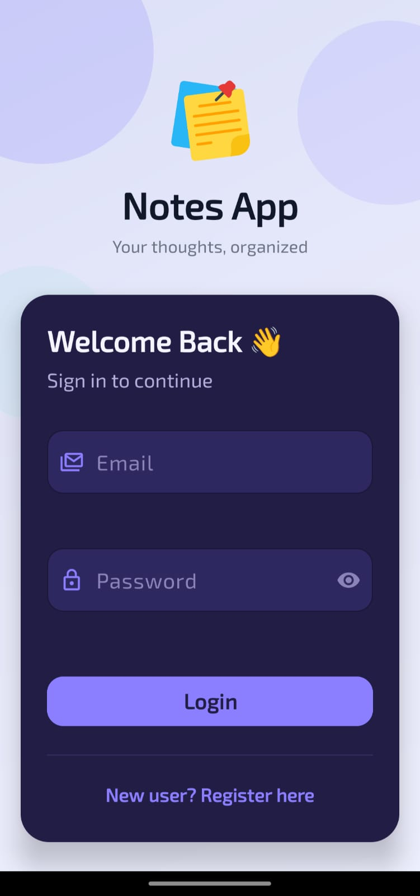
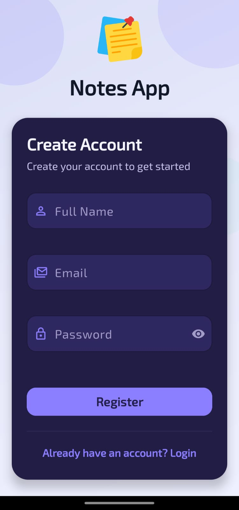
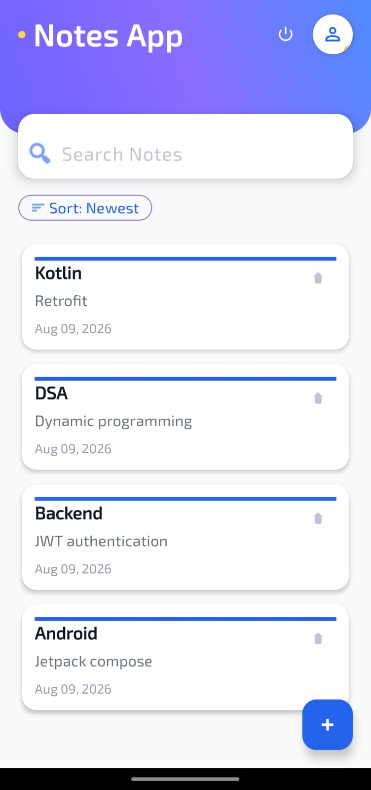
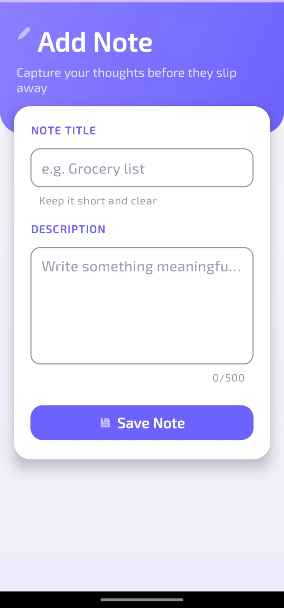
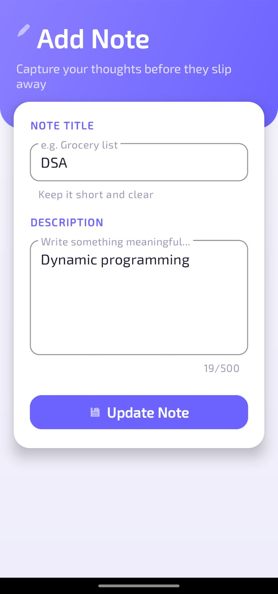
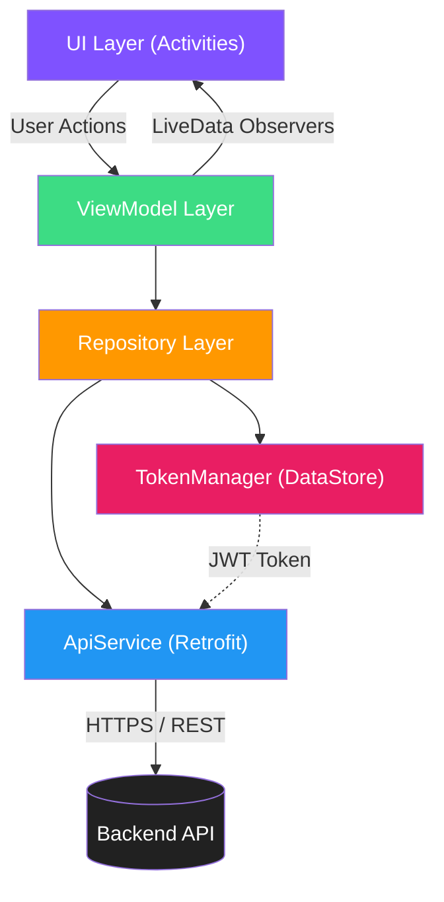

<div align="center">
 
# 📝 Inkora
 
### *Ink your thoughts. Anywhere. Anytime.*
 
A sleek, secure, and lightning-fast **native Android note-taking app** built with Kotlin — backed by a JWT-authenticated REST API for seamless cloud sync across devices.

<br/>


 
<br/>


**[📥 Download](#-installation--setup)** •
**[✨ Features](#-features)** •
**[📸 Screenshots](#-screenshots)** •
**[🏗️ Architecture](#️-architecture)** •
**[🛠️ Tech Stack](#️-tech-stack)** •
**[🚀 Getting Started](#-installation--setup)** •
**[🤝 Contributing](#-contributing)** •
**[📄 License](#-license)**
 
</div>
<br/>

---

## 📖 About The Project
 
**Inkora** is a modern, minimalist Android notes application designed to help you capture ideas the moment they strike. Built entirely in **Kotlin** with a clean **MVVM architecture**, Inkora communicates with a RESTful backend to keep your notes securely synced and accessible from anywhere.

Whether you're jotting down a quick reminder, drafting an idea, or organizing your day, Inkora combines a distraction-free interface with robust, secure cloud-backed storage — so your notes are never just stuck on one device.

> 💡 **Why "Inkora"?** — A fusion of *"Ink"* (the timeless act of writing) and *"Aura"* (a personal touch) — representing notes that carry your own creative energy.
 
<br/>

## ✨ Features
 
<table>
<tr>
<td width="50%" valign="top">

### 🔐 Secure Authentication
- User **Registration** & **Login** flows
- **JWT token-based** session management
- Encrypted local token persistence via **DataStore**

### 📝 Full Note Management (CRUD)
- Create new notes instantly
- View all notes in a clean, scrollable list
- Edit & update existing notes on the fly
- Delete notes with a single tap
</td>
<td width="50%" valign="top">

### 🔍 Smart Note Browsing
- **Pagination** support for large note collections
- **Search** notes by keyword
- **Sort** by creation date, title, and more
- Ascending / descending **ordering**

### ⚡ Performance & UX
- Reactive UI powered by **LiveData** & **ViewModel**
- Smooth network handling with **Retrofit + OkHttp**
- Clean, card-based **Material Design** interface
- View Binding for type-safe UI access
</td>
</tr>
</table>
<br/>

---

## 📸 Screenshots

| Login | Register | Home | Add Note | Update Note |
|:---:|:---:|:---:|:---:|:---:|
|  |  |  |  |  |
 
</div>
<br/>

---


## 🏗️ Architecture
 
Inkora follows a clean **MVVM (Model–View–ViewModel)** architecture pattern combined with a **Repository layer**, ensuring separation of concerns, testability, and scalability.


**Flow explained:**
1. **UI Layer** (`LoginActivity`, `RegisterActivity`, `HomeActivity`, `AddNoteActivity`) handles user interaction.
2. **ViewModel Layer** (`AuthViewModel`, `NoteViewModel`) exposes `LiveData` and manages UI-related state.
3. **Repository Layer** (`AuthRepository`, `NoteRepository`) acts as the single source of truth, abstracting data operations.
4. **ApiService** (Retrofit interface) defines and executes all network calls to the backend.
5. **TokenManager** securely stores and retrieves the JWT token using Jetpack **DataStore**.
<br/>

---

## 📂 Folder Structure
 
```
Inkora/
│
├── app/
│   ├── src/
│   │   ├── main/
│   │   │   ├── java/com/example/notesapp/
│   │   │   │   ├── api/                    # Retrofit API service & client instance
│   │   │   │   │   ├── ApiService.kt
│   │   │   │   │   └── RetrofitInstance.kt
│   │   │   │   │
│   │   │   │   ├── datastore/              # Local secure token storage
│   │   │   │   │   └── TokenManager.kt
│   │   │   │   │
│   │   │   │   ├── model/                  # Data classes / request & response models
│   │   │   │   │   ├── LoginRequest.kt
│   │   │   │   │   ├── LoginResponse.kt
│   │   │   │   │   ├── RegisterRequest.kt
│   │   │   │   │   ├── RegisterResponse.kt
│   │   │   │   │   ├── NoteRequest.kt
│   │   │   │   │   └── NoteResponse.kt
│   │   │   │   │
│   │   │   │   ├── repository/             # Repository layer (data abstraction)
│   │   │   │   │   ├── AuthRepository.kt
│   │   │   │   │   └── NoteRepository.kt
│   │   │   │   │
│   │   │   │   ├── viewmodel/              # ViewModels (MVVM state holders)
│   │   │   │   │   ├── AuthViewModel.kt
│   │   │   │   │   └── NoteViewModel.kt
│   │   │   │   │
│   │   │   │   ├── ui/                     # Activities grouped by feature
│   │   │   │   │   ├── login/
│   │   │   │   │   │   └── LoginActivity.kt
│   │   │   │   │   ├── register/
│   │   │   │   │   │   └── RegisterActivity.kt
│   │   │   │   │   ├── home/
│   │   │   │   │   │   ├── HomeActivity.kt
│   │   │   │   │   │   └── NoteAdapter.kt
│   │   │   │   │   └── addnote/
│   │   │   │   │       └── AddNoteActivity.kt
│   │   │   │   │
│   │   │   │   ├── utils/                  # Constants & network result wrappers
│   │   │   │   │   ├── Constants.kt
│   │   │   │   │   └── NetworkResult.kt
│   │   │   │   │
│   │   │   │   └── MainActivity.kt
│   │   │   │
│   │   │   ├── res/                        # Layouts, drawables, themes, strings
│   │   │   └── AndroidManifest.xml
│   │   │
│   │   ├── test/                           # Unit tests
│   │   └── androidTest/                    # Instrumented UI tests
│   │
│   └── build.gradle.kts                    # App-level Gradle config
│
├── gradle/
│   └── libs.versions.toml                  # Centralized dependency version catalog
│
├── build.gradle.kts                        # Project-level Gradle config
├── settings.gradle.kts
├── gradlew / gradlew.bat
├── LICENSE
└── README.md
```

<br/>

---

## 🛠️ Tech Stack
 
<div align="center">
 
| Category | Technology |
|---|---|
| **Language** |  |
| **Platform** |  |
| **Architecture** | MVVM + Repository Pattern |
| **Networking** |   |
| **Async / Reactive** | Kotlin Coroutines, LiveData |
| **Local Storage** | Jetpack DataStore (Preferences) |
| **UI Toolkit** | Material Components, ConstraintLayout, View Binding |
| **JSON Parsing** | Gson (via Retrofit Converter) |
| **Build System** | Gradle (Kotlin DSL) |
| **Version Control** | Git & GitHub |
 
</div>
<br/>

---

## 📦 Dependencies
 
Key libraries used in Inkora (see [`app/build.gradle.kts`](app/build.gradle.kts) for the full list):

```kotlin
// Networking
implementation("com.squareup.retrofit2:retrofit:2.11.0")
implementation("com.squareup.retrofit2:converter-gson:2.11.0")
implementation("com.squareup.okhttp3:logging-interceptor:4.12.0")
 
// Architecture Components (ViewModel + LiveData)
implementation("androidx.lifecycle:lifecycle-viewmodel-ktx:2.9.2")
implementation("androidx.lifecycle:lifecycle-livedata-ktx:2.9.2")

// Secure local storage for JWT token
implementation("androidx.datastore:datastore-preferences:1.1.7")
 
// Core Android & UI
implementation("androidx.core:core-ktx:1.12.0")
implementation("androidx.appcompat:appcompat")
implementation("androidx.constraintlayout:constraintlayout")
implementation("com.google.android.material:material:1.11.0")
implementation("androidx.activity:activity-ktx")
 
// Testing
testImplementation("junit:junit")
androidTestImplementation("androidx.test.ext:junit")
androidTestImplementation("androidx.test.espresso:espresso-core")
 ```
<br/>

## 🌐 API Overview
 
Inkora communicates with a RESTful backend exposing the following endpoints:
 
| Method | Endpoint | Description | Auth Required |
|---|---|---|:---:|
| `POST` | `/auth/register` | Register a new user account | ❌ |
| `POST` | `/auth/login` | Authenticate & receive JWT token | ❌ |
| `GET` | `/notes/` | Fetch notes (supports pagination, search & sort) | ✅ |
| `POST` | `/notes` | Create a new note | ✅ |
| `PUT` | `/notes/{note_id}` | Update an existing note | ✅ |
| `DELETE` | `/notes/{note_id}` | Delete a note | ✅ |
 
> 🔑 Authenticated routes require an `Authorization` header carrying the JWT bearer token issued at login.
 
<br/>

## 🚀 Installation & Setup
 
### ✅ Prerequisites
 
- **Android Studio** (Ladybug or newer recommended)
- **JDK 11+**
- An Android device / emulator running **API 24 (Android 7.0)** or above
- A running instance of the **Inkora backend API** (or your own compatible REST server)


### 📥 Clone the Repository
 
```bash
git clone https://github.com/ashish-modak-22/Inkora.git
cd Inkora
```
 
### ⚙️ Configure the Backend URL
 
Update the base URL in `app/src/main/java/com/example/notesapp/utils/Constants.kt` to point to your backend server:
 
```kotlin
object Constants {
    const val BASE_URL = "http://<your-server-ip>:8000/"
}
```
 
### ▶️ Build & Run
 
**Option 1 — Android Studio**
1. Open the project in Android Studio.
2. Let Gradle sync all dependencies.
3. Connect a device or start an emulator.
4. Click **Run ▶️**.
**Option 2 — Command Line**

```bash
# Give execution permission to the Gradle wrapper (Linux/macOS)
chmod +x gradlew
 
# Build a debug APK
./gradlew assembleDebug
 
# Install directly to a connected device/emulator
./gradlew installDebug
```
 
The generated APK will be available at:
```
app/build/outputs/apk/debug/app-debug.apk
```
 
<br/>

---

## 🗺️ Roadmap
 
- [ ] 🌙 Dark mode toggle in-app settings
- [ ] 🏷️ Note tagging / categorization
- [ ] 📎 Attachment support (images, files)
- [ ] 🔔 Reminders & notifications
- [ ] ☁️ Offline-first sync with local caching (Room)
- [ ] 🔒 Biometric app-lock
- [ ] 🌍 Multi-language support

<br/>

---


## 🤝 Contributing
 
Contributions make the open-source community an amazing place to learn, inspire, and create. Any contributions you make are **greatly appreciated**! ❤️

1. **Fork** the repository
2. Create your feature branch
```bash
   git checkout -b feature/AmazingFeature
```
3. Commit your changes
```bash
   git commit -m "Add: AmazingFeature"
```
4. Push to the branch
```bash
   git push origin feature/AmazingFeature
```
5. Open a **Pull Request** 🎉
<br/>

---


## 🐛 Reporting Issues
 
Found a bug or have a feature request? [Open an issue](../../issues) and describe:
- What you expected to happen
- What actually happened
- Steps to reproduce (if applicable)
- Screenshots/logs, if relevant
<br/>

---

## 📄 License
 
This project is open source and available under the [Apache License 2.0](License).

---


## 💖 Acknowledgements
 
- [Retrofit](https://square.github.io/retrofit/) — Type-safe HTTP client for Android
- [Material Components for Android](https://github.com/material-components/material-components-android)
- [Jetpack DataStore](https://developer.android.com/topic/libraries/architecture/datastore)
- [Shields.io](https://shields.io/) — for the crisp badges used in this README

---

<div align="center">
 
### ✍️ *"Every great idea starts with a single note."*
 
**Made with ❤️ and Kotlin by the Inkora Team**
 
⭐ **If you find this project useful, consider giving it a star!** ⭐
 
</div>
