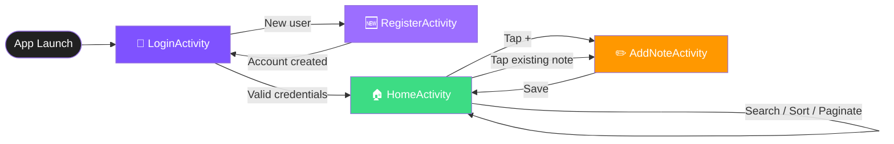
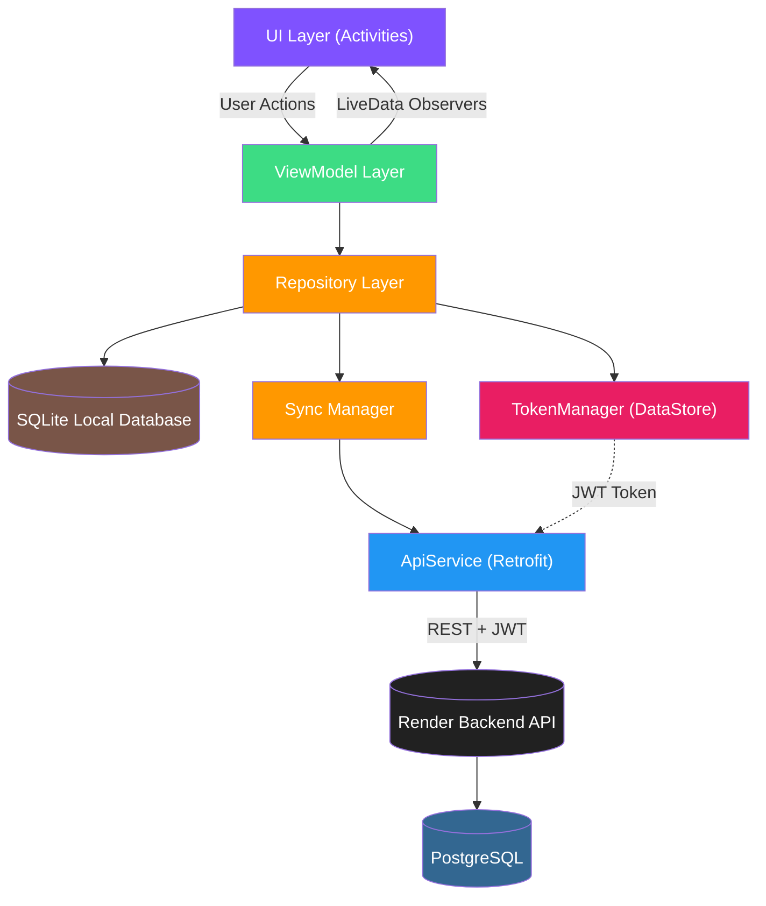
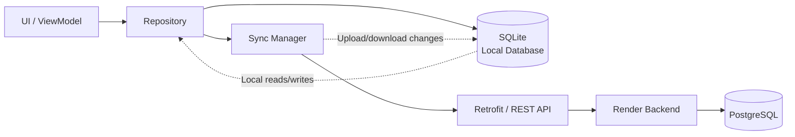

<div align="center">

```
██╗███╗   ██╗██╗  ██╗ ██████╗ ██████╗  █████╗ 
██║████╗  ██║██║ ██╔╝██╔═══██╗██╔══██╗██╔══██╗
██║██╔██╗ ██║█████╔╝ ██║   ██║██████╔╝███████║
██║██║╚██╗██║██╔═██╗ ██║   ██║██╔══██╗██╔══██║
██║██║ ╚████║██║  ██╗╚██████╔╝██║  ██║██║  ██║
╚═╝╚═╝  ╚═══╝╚═╝  ╚═╝ ╚═════╝ ╚═╝  ╚═╝╚═╝  ╚═╝

```
 
### *Ink your thoughts. Anywhere. Anytime.*
 
A sleek, secure, and lightning-fast **native Android note-taking app** built with Kotlin — powered by a local **SQLite database** for offline-first note access and a JWT-authenticated REST API for automatic cloud synchronization with a **Render-hosted PostgreSQL database**.

<br/>


 
<br/>

</div>


## 📚 Table of Contents
 
- [About The Project](#-about-the-project)
- [Features](#-features)
- [Screenshots](#-screenshots)
- [App Screens & User Flow](#-app-screens--user-flow)
- [Architecture](#️-architecture)
- [Folder Structure](#-folder-structure)
- [Tech Stack](#️-tech-stack)
- [Dependencies](#-dependencies)
- [Data Models](#-data-models)
- [API Overview](#-api-overview)
- [Installation & Setup](#-installation--setup)
- [Testing](#-testing)
- [Further Improvements](#️-further-improvements)
- [Contributing](#-contributing)
- [Reporting Issues](#-reporting-issues)
- [License](#-license)
- [Acknowledgements](#-acknowledgements)

 
<br/>

---

## 📖 About The Project
 
`Inkora` is a modern, minimalist Android notes application designed to help you capture ideas the moment they strike. Built entirely in `Kotlin` with a clean `MVVM architecture`, Inkora uses a `local SQLite database` as its offline data source and automatically synchronizes note changes with a `JWT-authenticated RESTful backend` backed by `PostgreSQL on Render`.

Whether you're jotting down a quick reminder, drafting an idea, or organizing your day, Inkora combines a distraction-free interface with robust local storage and secure cloud-backed synchronization — so your notes remain available even without an internet connection and can be synced to the cloud when connectivity is available.

> 💡 **Why "Inkora"?** — A fusion of *"Ink"* (the timeless act of writing) and *"Aura"* (a personal touch) — representing notes that carry your own creative energy.
 
<br/>

## ✨ Features
 
<table>
<tr>
<td width="50%" valign="top">

### 🔐 Secure Authentication
- User **Registration** & **Login** flows
- **JWT token-based** session management
- Encrypted local token persistence via **DataStore**

### 📝 Full Note Management (CRUD)
- Create new notes instantly
- View all notes in a clean, scrollable list
- Edit & update existing notes on the fly
- Delete notes with a single tap

### 💾 Offline-First Local Storage
- Notes are stored locally in a `SQLite database`
- Read, create, update, and delete notes without depending on network availability
- Local data provides a fast and responsive note-taking experience
- Local changes are retained until they can be synchronized with the backend

### 🔄 Automatic Cloud Sync
- Automatically synchronizes local note data with the backend
- Syncs changes between the local SQLite database and the `Render-hosted PostgreSQL` database
- Uses the authenticated REST API for secure synchronization
- Keeps cloud data available across devices after successful synchronization
</td>
<td width="50%" valign="top">

### 🔍 Smart Note Browsing
- `Pagination` support for large note collections
- `Search` notes by keyword
- `Sort` by creation date, title, and more
- Ascending / descending `ordering`

### ⚡ Performance & UX
- Reactive UI powered by **LiveData** & **ViewModel**
- Smooth network handling with **Retrofit + OkHttp**
- Clean, card-based **Material Design** interface
- View Binding for type-safe UI access
</td>
</tr>
</table>
<br/>

---

## 📸 Screenshots

| Login | Register | Home | Add Note | Update Note |
|:---:|:---:|:---:|:---:|:---:|
|  |  |  |  |  |
 
</div>
<br/>

---


## 🧭 App Screens & User Flow
 
Inkora's navigation is intentionally simple and linear, minimizing friction between "opening the app" and "writing a note."



| Screen | Activity Class | Layout File | Purpose |
|---|---|---|---|
| **Login** | `LoginActivity.kt` | `activity_login.xml` | App's launcher screen. Authenticates the user and stores the returned JWT via `TokenManager`. |
| **Register** | `RegisterActivity.kt` | `activity_register.xml` | Collects name, email & password to create a new account via `/auth/register`. |
| **Home** | `HomeActivity.kt` | `activity_home.xml` | Displays the authenticated user's notes in a `RecyclerView` (`NoteAdapter` + `item_note.xml`), with search/sort/pagination controls. |
| **Add / Edit Note** | `AddNoteActivity.kt` | `activity_add_note.xml` | Form for creating a new note or editing an existing one, then syncing it to the backend. |
| **Splash / Root** | `MainActivity.kt` | `activity_main.xml` | Base entry activity used for internal routing/setup. |
 
> 🎨 Inkora is themed on **Material 3 (`Theme.Material3.DayNight.NoActionBar`)**, meaning it automatically adapts to the system's **light/dark mode** out of the box.
 
<br/>

---

## 🏗️ Architecture
 
Inkora follows a clean **MVVM (Model–View–ViewModel)** architecture pattern combined with a **Repository layer**, ensuring separation of concerns, testability, and scalability.
 

 
**Flow explained:**
1. **UI Layer** (`LoginActivity`, `RegisterActivity`, `HomeActivity`, `AddNoteActivity`) handles user interaction.
2. **ViewModel Layer** (`AuthViewModel`, `NoteViewModel`) exposes `LiveData` and manages UI-related state.
3. **Repository Layer** (`AuthRepository`, `NoteRepository`) acts as the single source of truth, abstracting data operations.
4. **ApiService** (Retrofit interface) defines and executes all network calls to the backend.
5. **Local SQLite Database** stores notes on-device so the app can continue working offline.
6. **Sync Manager** coordinates synchronization between the local SQLite data and the remote backend.
7. **TokenManager** securely stores and retrieves the JWT token using Jetpack **DataStore**.

### 🔄 Offline-First Data Flow



**How synchronization works:**
1. Notes are first handled through the local **SQLite database**, allowing the app to remain usable offline.
2. The Repository coordinates local data operations and network synchronization.
3. When synchronization is possible, local changes are sent to the backend through the authenticated REST API.
4. The backend persists the synchronized note data in **PostgreSQL hosted on Render**.
5. Remote note data can be synchronized back to the local SQLite database so the local cache stays up to date.
<br/>

## 📂 Folder Structure
 
```
Inkora/
│
├── app/
│   ├── src/
│   │   ├── main/
│   │   │   ├── java/com/example/notesapp/
│   │   │   │   ├── api/                    # Retrofit API service & client instance
│   │   │   │   │   ├── ApiService.kt
│   │   │   │   │   └── RetrofitInstance.kt
│   │   │   │   │
│   │   │   │   ├── datastore/              # Local secure token storage
│   │   │   │   │   └── TokenManager.kt
│   │   │   │   │
│   │   │   │   ├── database/                # Local SQLite database & persistence layer
│   │   │   │   │
│   │   │   │   ├── sync/                    # Local ↔ remote synchronization logic
│   │   │   │   │
│   │   │   │   ├── model/                  # Data classes / request & response models
│   │   │   │   │   ├── LoginRequest.kt
│   │   │   │   │   ├── LoginResponse.kt
│   │   │   │   │   ├── RegisterRequest.kt
│   │   │   │   │   ├── RegisterResponse.kt
│   │   │   │   │   ├── NoteRequest.kt
│   │   │   │   │   └── NoteResponse.kt
│   │   │   │   │
│   │   │   │   ├── repository/             # Repository layer (data abstraction)
│   │   │   │   │   ├── AuthRepository.kt
│   │   │   │   │   └── NoteRepository.kt
│   │   │   │   │
│   │   │   │   ├── viewmodel/              # ViewModels (MVVM state holders)
│   │   │   │   │   ├── AuthViewModel.kt
│   │   │   │   │   └── NoteViewModel.kt
│   │   │   │   │
│   │   │   │   ├── ui/                     # Activities grouped by feature
│   │   │   │   │   ├── login/
│   │   │   │   │   │   └── LoginActivity.kt
│   │   │   │   │   ├── register/
│   │   │   │   │   │   └── RegisterActivity.kt
│   │   │   │   │   ├── home/
│   │   │   │   │   │   ├── HomeActivity.kt
│   │   │   │   │   │   └── NoteAdapter.kt
│   │   │   │   │   └── addnote/
│   │   │   │   │       └── AddNoteActivity.kt
│   │   │   │   │
│   │   │   │   ├── utils/                  # Constants & network result wrappers
│   │   │   │   │   ├── Constants.kt
│   │   │   │   │   └── NetworkResult.kt
│   │   │   │   │
│   │   │   │   └── MainActivity.kt
│   │   │   │
│   │   │   ├── res/                        # Layouts, drawables, themes, strings
│   │   │   └── AndroidManifest.xml
│   │   │
│   │   ├── test/                           # Unit tests
│   │   └── androidTest/                    # Instrumented UI tests
│   │
│   └── build.gradle.kts                    # App-level Gradle config
│
├── gradle/
│   └── libs.versions.toml                  # Centralized dependency version catalog
│
├── build.gradle.kts                        # Project-level Gradle config
├── settings.gradle.kts
├── gradlew / gradlew.bat
├── LICENSE
└── README.md
```

<br/>

---

## 🛠️ Tech Stack
 
<div align="center">
 
| Category | Technology |
|---|---|
| **Language** |  |
| **Platform** |  |
| **Architecture** | MVVM + Repository Pattern |
| **Networking** |   |
| **Async / Reactive** | Kotlin Coroutines, LiveData |
| **Local Storage** | SQLite + Jetpack DataStore (Preferences) |
| **Cloud Database** | PostgreSQL (Render) |
| **Sync Strategy** | Offline-first local storage + automatic cloud synchronization |
| **UI Toolkit** | Material Components, ConstraintLayout, View Binding |
| **JSON Parsing** | Gson (via Retrofit Converter) |
| **Build System** | Gradle (Kotlin DSL) |
| **Version Control** | Git & GitHub |
 
</div>
<br/>

---

## 📦 Dependencies
 
Key libraries used in Inkora (see [`app/build.gradle.kts`](app/build.gradle.kts) for the full list):

```kotlin
// Networking
implementation("com.squareup.retrofit2:retrofit:2.11.0")
implementation("com.squareup.retrofit2:converter-gson:2.11.0")
implementation("com.squareup.okhttp3:logging-interceptor:4.12.0")
 
// Architecture Components (ViewModel + LiveData)
implementation("androidx.lifecycle:lifecycle-viewmodel-ktx:2.9.2")
implementation("androidx.lifecycle:lifecycle-livedata-ktx:2.9.2")

// Secure local storage for JWT token
implementation("androidx.datastore:datastore-preferences:1.1.7")

// Local SQLite database
// Uses Android's built-in SQLite APIs; no Room dependency is required.
 
// Core Android & UI
implementation("androidx.core:core-ktx:1.12.0")
implementation("androidx.appcompat:appcompat")
implementation("androidx.constraintlayout:constraintlayout")
implementation("com.google.android.material:material:1.11.0")
implementation("androidx.activity:activity-ktx")
 
// Testing
testImplementation("junit:junit")
androidTestImplementation("androidx.test.ext:junit")
androidTestImplementation("androidx.test.espresso:espresso-core")
 ```
<br/>

---

## 🧬 Data Models
 
All network payloads are represented as Kotlin `data class`es and (de)serialized automatically via **Gson**. These live under `model/`. Notes are additionally persisted locally using **SQLite** so the app can operate offline and synchronize with the remote backend when possible.
 
<details>
<summary><b>🔐 Authentication Models</b> (click to expand)</summary>
 
```kotlin
// Sent to POST /auth/register
data class RegisterRequest(
    val name: String,
    val email: String,
    val password: String
)
 
// Returned from POST /auth/register
data class RegisterResponse(
    val id: Int,
    val name: String,
    val email: String
)
 
// Sent to POST /auth/login
data class LoginRequest(
    val email: String,
    val password: String
)
 
// Returned from POST /auth/login
data class LoginResponse(
    @SerializedName("access_token") val accessToken: String,
    @SerializedName("token_type")   val tokenType: String
)
```
 
</details>
<details>
<summary><b>📝 Note Models</b> (click to expand)</summary>
 
```kotlin
// Sent to POST /notes and PUT /notes/{note_id}
data class NoteRequest(
    @SerializedName("title")   val title: String,
    @SerializedName("content") val content: String
)
 
// Returned from GET /notes/, POST /notes, PUT /notes/{note_id}
data class NoteResponse(
    @SerializedName("id")         val id: Int,
    @SerializedName("title")      val title: String,
    @SerializedName("content")    val content: String,
    @SerializedName("created_at") val createdAt: String,
    @SerializedName("updated_at") val updatedAt: String
)
```
 
</details>
<br/>

---

## 🌐 API Overview
 
Inkora communicates with a RESTful backend exposing the following endpoints:
 
| Method | Endpoint | Description | Auth Required |
|---|---|---|:---:|
| `POST` | `/auth/register` | Register a new user account | ❌ |
| `POST` | `/auth/login` | Authenticate & receive JWT token | ❌ |
| `GET` | `/notes/` | Fetch notes (supports pagination, search & sort) | ✅ |
| `POST` | `/notes` | Create a new note | ✅ |
| `PUT` | `/notes/{note_id}` | Update an existing note | ✅ |
| `DELETE` | `/notes/{note_id}` | Delete a note | ✅ |
 
> 🔑 Authenticated routes require an `Authorization` header carrying the JWT bearer token issued at login.
 
<br/>

## 🚀 Installation & Setup
 
### ✅ Prerequisites
 
- **Android Studio** (Ladybug or newer recommended)
- **JDK 11+**
- An Android device / emulator running **API 24 (Android 7.0)** or above
- A running instance of the **Inkora backend API** (or your own compatible REST server)


### 📥 Clone the Repository
 
```bash
git clone https://github.com/ashish-modak-22/Inkora.git
cd Inkora
```
 
### ⚙️ Configure the Backend URL
 
Update the base URL in `app/src/main/java/com/example/notesapp/utils/Constants.kt` to point to your backend server:
 
```kotlin
object Constants {
    const val BASE_URL = "http://<your-server-ip>:8000/"
}
```
 
### ▶️ Build & Run
 
**Option 1 — Android Studio**
1. Open the project in Android Studio.
2. Let Gradle sync all dependencies.
3. Connect a device or start an emulator.
4. Click **Run ▶️**.
**Option 2 — Command Line**

```bash
# Give execution permission to the Gradle wrapper (Linux/macOS)
chmod +x gradlew
 
# Build a debug APK
./gradlew assembleDebug
 
# Install directly to a connected device/emulator
./gradlew installDebug
```
 
The generated APK will be available at:
```
app/build/outputs/apk/debug/app-debug.apk
```
 
<br/>

---

## 🔒 Security Notes
 
- Passwords are **never stored locally** — only the short-lived **JWT access token** returned after login is persisted, via Jetpack `DataStore` (`TokenManager.kt`).
- The token is attached as a Bearer credential in the `Authorization` header on every protected request (`/notes/*`).
- `clearToken()` wipes the stored session on logout, ensuring no stale credentials remain on-device.
- Note content is persisted locally in the app's **SQLite database** to support offline usage.
- Local SQLite storage and remote PostgreSQL storage are synchronized through the authenticated backend API.
- ⚠️ **Development note:** `android:usesCleartextTraffic="true"` is currently enabled in the manifest to allow HTTP calls to a local backend during development. **Disable this and switch to HTTPS before any production release.**
  
<br/>

---

## 🔄 Offline & Sync Behavior

Inkora follows an **offline-first** approach for notes:

| Situation | App Behavior |
|---|---|
| **Online** | Notes are read/written locally and synchronized with the remote backend |
| **Offline** | Notes remain available through the local SQLite database |
| **Connection restored** | Pending local changes can be synchronized with the backend |
| **Remote data available** | Synchronized data is stored locally so it remains accessible offline |

The remote backend uses **PostgreSQL hosted on Render** as the cloud data store, while SQLite acts as the on-device data store.

<br/>

---

## 🧪 Testing
 
Inkora ships with the standard Android testing scaffolding, ready to be extended:
 
| Type | Location | Framework |
|---|---|---|
| **Unit Tests** | `app/src/test/java/.../ExampleUnitTest.kt` | JUnit 4 |
| **Instrumented Tests** | `app/src/androidTest/java/.../ExampleInstrumentedTest.kt` | AndroidX Test + Espresso |
 
Run tests via Gradle:
 
```bash
# Run local unit tests
./gradlew test
 
# Run instrumented tests on a connected device/emulator
./gradlew connectedAndroidTest
```
 
> 🧩 **Contributor tip:** Repository and ViewModel classes are prime candidates for unit tests using `MockWebServer` / `Mockito` to simulate API responses — contributions here are especially welcome!
 
<br/>

---

## 🗺️ Further Improvements
 
- [ ] 🌙 Dark mode toggle in-app settings
- [ ] 🏷️ Note tagging / categorization
- [ ] 📎 Attachment support (images, files)
- [ ] 🔔 Reminders & notifications
- [x] ☁️ Offline-first sync with local SQLite storage and automatic cloud synchronization
- [ ] 🔒 Biometric app-lock
- [ ] 🌍 Multi-language support

<br/>

---


## 🤝 Contributing
 
Contributions make the open-source community an amazing place to learn, inspire, and create. Any contributions you make are **greatly appreciated**! ❤️

1. **Fork** the repository
2. Create your feature branch
```bash
   git checkout -b feature/AmazingFeature
```
3. Commit your changes
```bash
   git commit -m "Add: AmazingFeature"
```
4. Push to the branch
```bash
   git push origin feature/AmazingFeature
```
5. Open a **Pull Request** 🎉
<br/>

---


## 🐛 Reporting Issues
 
Found a bug or have a feature request? [Open an issue](../../issues) and describe:
- What you expected to happen
- What actually happened
- Steps to reproduce (if applicable)
- Screenshots/logs, if relevant
<br/>

---

## 📄 License
 
This project is open source and available under the [Apache License 2.0](License).

---


## 💖 Acknowledgements
 
- [Retrofit](https://square.github.io/retrofit/) — Type-safe HTTP client for Android
- [Material Components for Android](https://github.com/material-components/material-components-android)
- [Jetpack DataStore](https://developer.android.com/topic/libraries/architecture/datastore)
- [Shields.io](https://shields.io/) — for the crisp badges used in this README

---

<div align="center">
 
### ✍️ *"Every great idea starts with a single note."*
 
**Made with ❤️ and Kotlin**
 
⭐ **If you find this project useful, consider giving it a star!** ⭐
 
</div>
